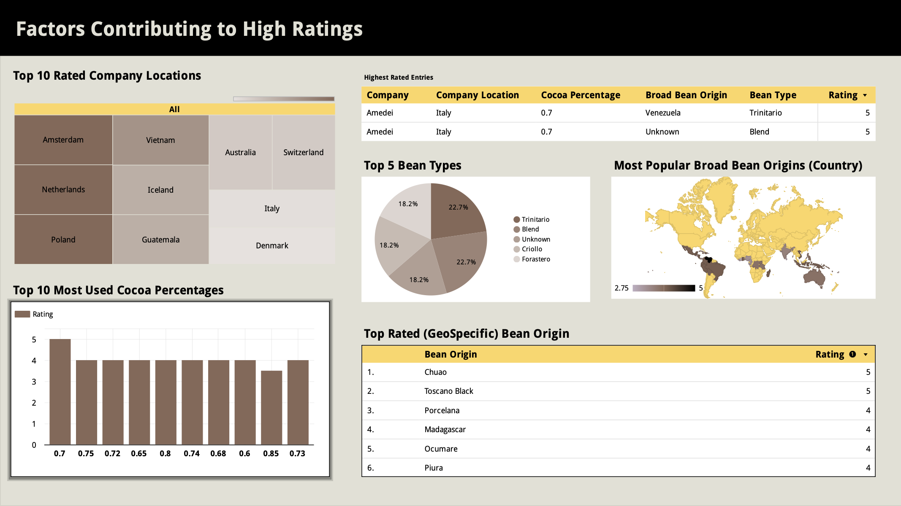
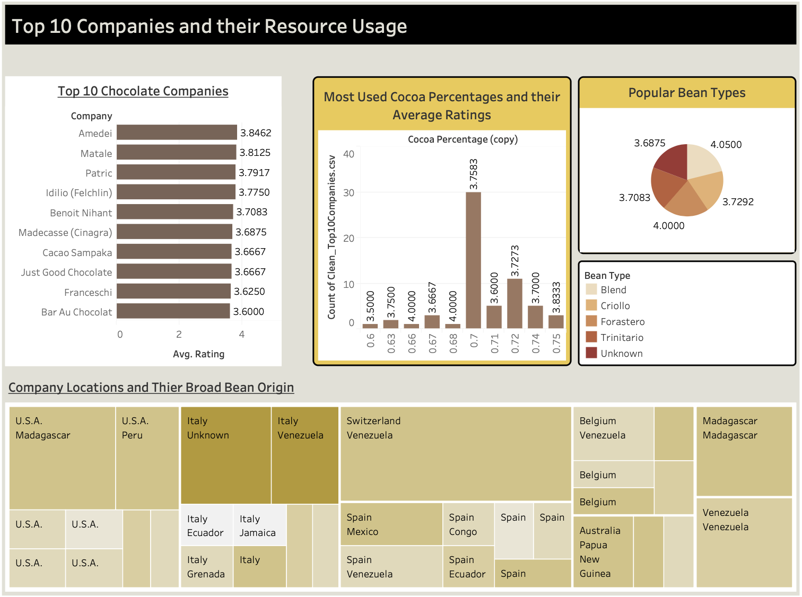
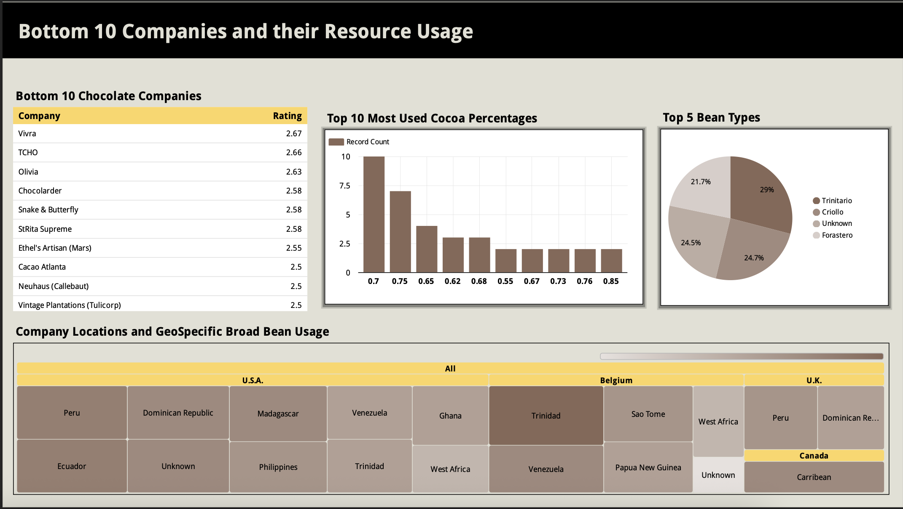

# Chocolate Bar Ratings - Data Analysis (EDA & Visualization)
## Executive Summary
Analyzed and found which ​elements from the five major factors (Cocoa Percentage, Company Location, Bean Origin, Broad Bean Origin, Bean Type) directly influenced a chocolate bars' rating and cross checked these results with the top ten highly rated companies. 

**Key Findings**
- Top performing factors when considering creating a chocolate bar​
- An insight on the usage of resources from the top ten companies​
- Why the worst rated companies are at the bottom

## Business Task
This dataset contains expert ratings of over 1,700 chocolate bars from different companies. A rating here represents an experience with one bar from each batch. The objective is to perform exploratory data analysis and visualization to determine which company produces the best chocolate bars and what factors go into doing so.

**Initial Questions**
- What are the top 10 chocolate bar companies?​
- Which countries produce the highest rated bars?​
- What factors are 'the best' when creating a chocolate bar?​
- How can we improve ratings?

## Data Sources
Dataset from Kaggle: [Kaggle Dataset](https://www.kaggle.com/datasets/rtatman/chocolate-bar-ratings)

**Source:** Public data from Kaggle

**File Name:** flavors_of_cacao.csv

| Column Name | Description | Data Type |
| ------------- | ------------- | ------------- |
| Company | Chocolate Bar manufacturer | object |
| Specific Bean Origin | specific geolocation of bean | object |
| REF | when the review was entered into the database | int |
| Review Date | date review was published | object |
| Cocoa Percent | percentage of chocolate bar | object |
| Company Location | manufacturer base company | object |
| Rating | rating out of 5 | float |
| Bean Type | variety of bean used | object |
| Broad Bean Origin | broad geolocation of bean | object |

## Methodology
### Cleaning
**Starting shape: (1795, 9)​**

1. Checking all columns for missing data​
2. Renaming Column Names​, Dropping any null values​
3. Reducing Varieties of Beans from Bean Origin (1039 to 508), Broad Bean Origin (99 to 57), Bean Type (41 to 11)​
4. Fixing mistyped locations and company names
5. Dropping Useless Columns (REF, Bean Origin, Bean Type, Broad Bean Origin) (we replaced these with their simplified versions)​
6. Correcting column data types to make data easier to work with (Cocoa   Percentage from object to float)​
7. Reducing Companies by removing those that have 2 or less entries (carry the potential to skew the ratings)​

**Final shape: (1675, 8)​**

### Manipulation
#### Phase 1 (Top Companies and their Usage of Resources)​
1. Find the top 10 chocolate bar companies by using an average overall rating of all company entries​
2. Find out why these are the most highly rated companies by looking into the factors that make up chocolate bars​
3. Locate where all these companies base their manufacturers​
4. Find out what cocoa percentages companies are using and what rating each percentage returns​
5. Compare the average rating of Company Location and Cocoa Percentage​
6. Find out the type of Broad and Specific geo-specific beans the top companies use and what ratings are associated with them​
7. Find out which Bean Types companies use​
8. Create a DataFrame of the best performing year(s) for each top company and their average ratings

#### Phase 2 (Finding the 'Best' Objective Resources to Use)​
1. Top Company Locations with the highest average rating​
2. Visual of distribution of chocolate companies across the world​
3. Most popular used Cocoa Percentages and how many entries are found​
4. Best Broad Bean Origin/Rating combination​
5. Best Bean Type grouped in order of best rating found​
6. Bean Origin found by taking the average of all entries with that specific bean

#### Phase 3 (Narrowing Down the 'Perfect' Chocolate Bar)​
1. Create subsets using the 'best' components of all factors to see which companies use them​
2. Create a conditional statement that checks to see how many of the top companies use one or more top factors in their chocolate bars (starting 64 entries from top companies, all 64 entries satisfy this requirement)​
3. Create a conditional statement that checks how many top companies utilize components from ALL factors in one chocolate bar (only 6 entries returned)

#### Phase 4 (Bottom 10 Companies)​
1. Find the bottom 10 chocolate bar companies by using an average overall rating of all company entries​
2. Create a subset of just the worst chocolate bar companies​
3. Cross check which companies utilize all 'best' components from factors (none)​
4. Check each factor individually to see how the bottom companies utilize their resources

## Visualizations
Google Data Studio/Looker: [Google Public View](https://datastudio.google.com/reporting/ddf719eb-7145-4137-82bf-3c0b46b9f70e)

Tableau Public: [Tableau Public Link](https://public.tableau.com/views/CacaoViz_Tableau/Bottom10CompaniesandthierResourceUsage?:language=en-US&publish=yes&:sid=&:display_count=n&:origin=viz_share_link)

## Summary of Key Findings
- Amedei Chocolate Company, Idilio (Felchlin), Matale, Patric, and Benoit Nihant are the ideal companies. They utilize resources from all components that are considered to be the ‘best’.​
- When including those entries that met all criteria for higher ratings, only six were returned. From those six entries, two scored a perfect 5.0.​
- The bottom ten companies all scored between 2.5 - 2.7. None met the criteria of fulfilling all ‘best’ factors in their chocolate bars. None were from desirable locations. These companies did not employ these components in the right combinations.

- The companies that decide to factor in more components from the best features are likely going to be the most successful in the long term.​

​

- Location seems to be the most important factor in the manufacturing process, with cocoa percentage being the least.​
- The top ten companies are at the top because they employ the use of the best resources possible.​
- If more companies used different Broad Bean Origins (located in the best top ten) and Bean Types (Best top five), they would receive better ratings in the long run.​

## Recommendations & Next Steps
1. **Company Location**
    - 3/10 top companies were in desired locations, while 0/10 bottom companies found. All companies should take advantage of the 'best' locations to manufacture chocolate and allocate resources there.​
2. **Underutilized Resources**
    - All companies should utilize the lesser used 'best' resources. Amazon, Criollo are hardly used Bean Types. Vietnam and Sao Tome are underutilized Broad Bean Origins. Etc.​
3. **Improving Ratings**
    - Companies begin to exclusively choose from the objective best resources to maximize ratings. For those tight on resources, choose from the most critical factors (Location (3/10 top), ​Bean Origin(5/10 top))
